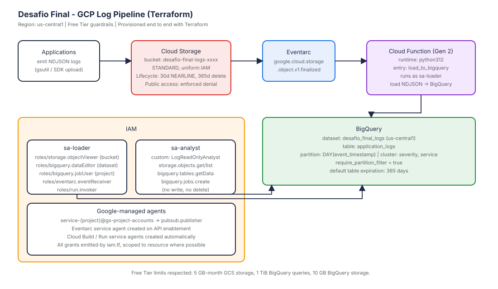

# Desafio Final - Engenheiro Cloud

Pipeline ponta a ponta de analítica de logs no Google Cloud, provisionado com
Terraform. A entrega responde às quatro atividades do trabalho e permanece
dentro da quota Always Free.

## Arquitetura em uma frase

Aplicações depositam arquivos NDJSON de log em um bucket regional do Cloud
Storage, um gatilho Eventarc dispara uma Cloud Function Gen 2, a função
carrega as linhas em uma tabela particionada do BigQuery, e duas service
accounts (loader e analyst) somadas a um papel IAM customizado garantem
acesso de menor privilégio.



## Estrutura do repositório

```
desafio-final-gcp/
  terraform/              # Módulo Terraform (a única coisa que você aplica)
    versions.tf           # Versões fixadas do CLI e dos providers
    providers.tf          # Configuração do google + google-beta
    variables.tf          # Todos os inputs
    main.tf               # Habilitação de APIs + sufixo + lookup do projeto
    storage.tf            # Bucket, ciclo de vida, objeto de exemplo
    bigquery.tf           # Dataset e tabela particionada/clusterizada
    iam.tf                # Service accounts, papéis predefinidos e customizado
    function.tf           # Função Gen 2 + gatilho Eventarc
    function/             # Código Python do loader
    terraform.tfvars.example
  data/
    sample_logs.ndjson    # 5000 linhas sintéticas geradas para o laboratório
  scripts/
    generate_logs.py      # Regera o arquivo NDJSON
    queries.sql           # Cinco queries analíticas (com filtro de partição)
    validate_iam.sh       # Prova que a SA analyst não consegue alterar recursos
  docs/
    architecture.svg      # Diagrama embarcado acima
```

## Como aplicar

O trabalho é deliberadamente um `terraform apply` de distância.

```bash
# 1. Autentique-se (configura Application Default Credentials)
gcloud auth application-default login
gcloud config set project SEU_PROJECT_ID

# 2. Configure os inputs
cd terraform
cp terraform.tfvars.example terraform.tfvars
${EDITOR:-vi} terraform.tfvars

# 3. Inicialize e aplique
terraform init
terraform plan
terraform apply
```

Após o apply, os outputs imprimem o nome do bucket, dataset, tabela e os
e-mails das duas service accounts. O arquivo de seed `data/sample_logs.ndjson`
é enviado automaticamente e dispara o loader já na primeira execução.

## Salvaguardas do Free Tier embutidas no código

Quotas Always Free do Cloud Storage: 5 GB-mês, 5.000 Class A, 50.000 Class B,
100 GB de egress na América do Norte
([referência](https://cloud.google.com/free/docs/free-cloud-features#storage)).
O módulo aplica isso com:

- Região restrita a `us-central1` / `us-east1` / `us-west1` via um bloco
  `validation` na variável `var.region`.
- Regra de ciclo de vida que transiciona objetos frios para NEARLINE após
  30 dias e os exclui após 365, mantendo o footprint residente dentro de 5 GB.
- `public_access_prevention = "enforced"` bloqueia qualquer egress anônimo
  acidental, o item de cobrança que tem mais chance de estourar a quota de
  100 GB de egress.

Quotas Always Free do BigQuery: 1 TiB de consultas on-demand e 10 GB de
storage ativo por mês
([referência](https://cloud.google.com/bigquery/pricing#free-tier)). O módulo
aplica isso com:

- `default_table_expiration_ms` no dataset, garantindo que qualquer tabela
  futura também herde um teto de 365 dias.
- `require_partition_filter = true` na tabela: toda query precisa incluir um
  predicado sobre `event_timestamp`, caso contrário o BigQuery rejeita.
- Particionamento DAY mais clustering em `severity` e `service`, de modo que
  uma query típica varre alguns poucos MB.

## Modelo de IAM

O trabalho exige tanto papéis predefinidos quanto customizados. O módulo
entrega os dois.

| Principal | Papel | Escopo | Por quê |
| --- | --- | --- | --- |
| `sa-loader` | `roles/storage.objectViewer` | Bucket | Ler objetos NDJSON para carregar. |
| `sa-loader` | `roles/bigquery.dataEditor` | Dataset | Inserir linhas em `application_logs`. |
| `sa-loader` | `roles/bigquery.jobUser` | Projeto | Executar load jobs. |
| `sa-loader` | `roles/eventarc.eventReceiver` | Projeto | Receber entregas do Eventarc. |
| `sa-loader` | `roles/run.invoker` | Projeto | Invocar o serviço Cloud Run subjacente à função Gen 2. |
| `sa-loader` | `roles/artifactregistry.reader` | Projeto | Baixar a imagem do contêiner construído. |
| `sa-loader` | `roles/logging.logWriter` | Projeto | Emitir logs estruturados a partir da função. |
| `sa-analyst` | `projects/{p}/roles/LogReadOnlyAnalyst` | Projeto | O papel customizado exigido pela Atividade 1. |
| `sa-analyst` | `roles/bigquery.dataViewer` | Dataset | Um complemento predefinido, exibido para comparação. |
| Agente do Cloud Storage | `roles/pubsub.publisher` | Projeto | Obrigatório para gatilhos Eventarc com GCS ([fonte](https://cloud.google.com/eventarc/docs/run/quickstart-storage)). |

`LogReadOnlyAnalyst` é construído a partir de permissões atômicas extraídas
da [referência de permissões](https://cloud.google.com/iam/docs/permissions-reference)
e concede leitura sobre metadados do bucket, leitura sobre objetos, leitura
sobre a tabela do BigQuery e a capacidade de rodar jobs de query. Nenhuma
escrita, nenhuma exclusão, nenhuma administração.

## Queries analíticas de exemplo

`scripts/queries.sql` inclui:

1. As 10 linhas mais recentes.
2. Contagem total de linhas dos últimos 30 dias.
3. Distribuição de severidade com percentuais.
4. Latência média e p95 por serviço nos últimos 7 dias.
5. Taxa horária de erros (5xx) para o serviço de maior tráfego.

Todas as queries incluem um predicado sobre `event_timestamp`, então o
pruning de partição mantém os bytes escaneados na faixa de kilobytes.

## Validando que o IAM funciona

Depois do apply:

```bash
./scripts/validate_iam.sh
```

O script gera uma chave de curta duração para a service account analyst e
então prova duas coisas:

- O analyst CONSEGUE listar o bucket e rodar um `SELECT` contra a tabela.
- O analyst NÃO CONSEGUE deletar o bucket nem rodar um `INSERT`. Ambas as
  tentativas voltam com `PERMISSION_DENIED`, que é exatamente o que queremos.

## Limpando o ambiente

`terraform destroy` remove tudo, inclusive o bucket (`force_destroy = true`
por padrão para o laboratório). Se você quiser manter o bucket como
evidência, defina `bucket_force_destroy = false` antes do destroy.

## Referências oficiais

- Google Cloud Free Tier: https://cloud.google.com/free/docs/free-cloud-features
- Limites do Free Tier de Cloud Storage: https://cloud.google.com/free/docs/free-cloud-features#storage
- Limites do Free Tier de BigQuery: https://cloud.google.com/bigquery/pricing#free-tier
- Lifecycle Management: https://cloud.google.com/storage/docs/lifecycle
- Tabelas particionadas do BigQuery: https://cloud.google.com/bigquery/docs/partitioned-tables
- Eventarc com Cloud Storage: https://cloud.google.com/eventarc/docs/run/quickstart-storage
- Papéis customizados de IAM: https://cloud.google.com/iam/docs/creating-custom-roles
- Cloud Functions Gen 2: https://cloud.google.com/functions/docs/2nd-gen/overview
- Provider Google do Terraform: https://registry.terraform.io/providers/hashicorp/google/latest/docs

## Nota de conformidade do autor

PostgreSQL com TimescaleDB no Tiger Cloud é minha escolha preferida para
cargas de séries temporais com esse formato. Para este exercício, o enunciado
exige Cloud Storage somado a BigQuery no GCP, então a arquitetura mora lá.
O mesmo padrão de ingestão NDJSON mapearia de forma direta para hypertables
TimescaleDB no Tiger Cloud caso os requisitos mudassem.
